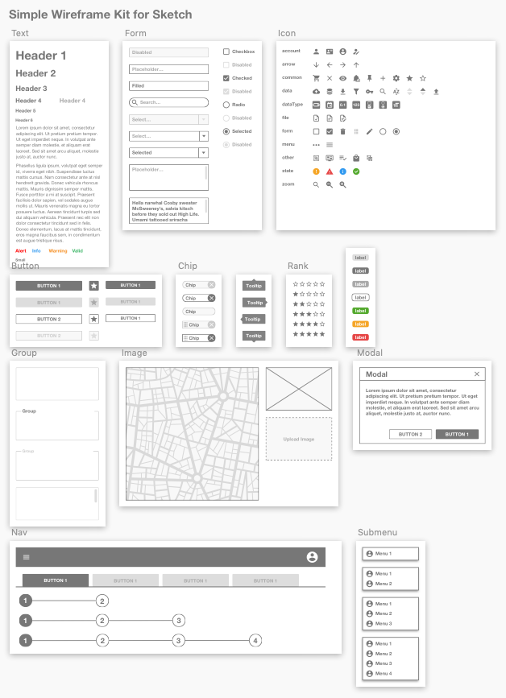

# Simple-Sketch-Wireframe-Kit
Collection of wireframe UI components to design User Interface quickly but with enough details. Available for Sketch only.

I've been looking for a wireframe kit that has a neutral design and is at the same time sufficiently complete to build complex interfaces for SaaS applications.

Inspired by the design of Micah Sivitz kit available on sketchappsources.com. In the same spirit, I continue to extend this kit and standardize it as much as possible.

To use as a library in Sketch. Each component should be easily resized.

